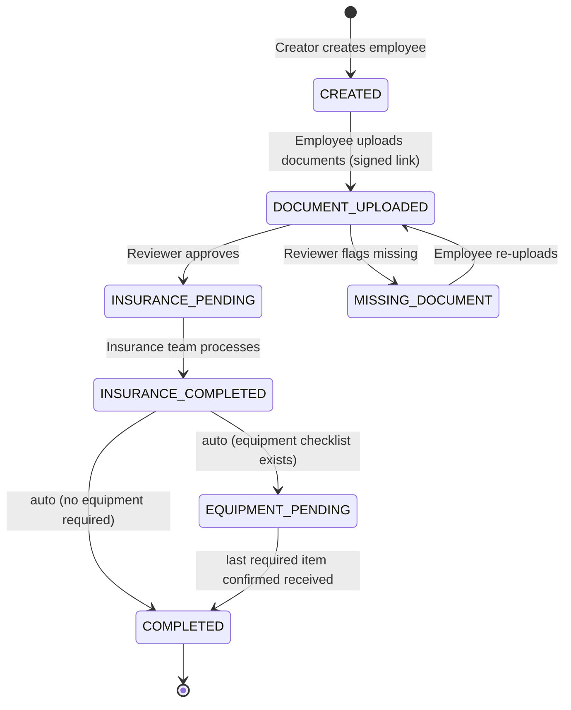

# Employee Onboarding & Insurance Workflow

A backend-driven onboarding system that walks a new employee from creation through
document collection, review, insurance processing, and equipment handover to completion —
modelled as an explicit **state machine** with **event-driven notifications**,
**role-based access**, and a **layered, testable architecture**.

> Built with Node.js + TypeScript (Express), Next.js, and PostgreSQL + Prisma.


---

## 1. Problem

Onboarding is a multi-party process: a **creator** registers the employee, the
**employee** uploads documents, a **reviewer** approves or flags missing documents,
an **insurance team** completes coverage, and equipment (laptop, headphone, …) must be
handed over and confirmed. Each hand-off must be tracked, auditable, and impossible to
skip. The record therefore moves through a strict set of **statuses**, and each
transition may trigger side effects (emails, links, alerts) that must *not* be tangled
into the core business rules.

## 2. Workflow (state machine)



Transitions are **the single source of truth**. A record can only move along a defined
edge; any illegal transition is rejected before it touches the database.

**Finalization semantics** (decided): the insurance-team user drives the tail of the
workflow. Completing insurance writes `INSURANCE_COMPLETED` and — in the same
transaction — advances to `EQUIPMENT_PENDING` (or straight to `COMPLETED` if the
employee has no equipment checklist). Each equipment item (e.g. **laptop**,
**headphone**) is confirmed *individually*; confirming the last required item
transitions the record to `COMPLETED`. Every one of these steps — including the
automatic ones and each per-item confirmation — is written to the append-only audit
log with the acting user, so the full history is preserved.

**Employee access** (decided): employees do **not** get an account initially. They
interact through **signed, expiring links** sent by email (upload / re-upload). A later
phase can add an optional login so an employee can view their own status timeline.

## 3. Architecture

A clean, layered flow with one responsibility per layer:

```
HTTP  ─▶  Route  ─▶  Controller  ─▶  Service (business logic)  ─▶  Repository  ─▶  DB
                                          │
                                          └─▶ emits Domain Event ─▶ Event Bus ─▶ Notification handlers
                                                                                  (email / SMS / WhatsApp)
```

- **Controllers** parse/validate input and shape responses — no business logic.
- **Services** own the rules and the **state-machine transitions**. They *emit events*;
  they never call the mailer directly.
- **Repositories** are the only place that talks to Prisma — data access is swappable and mockable.
- **Event bus + handlers** react to events asynchronously — this is how notifications stay
  fully decoupled from the logic (see §4.2).

## 4. Core design decisions

### 4.1 Status as an explicit State Machine — *State pattern*
A central `transition(record, action, actor)` function defines every legal edge and the
guard conditions for it (e.g. only an `INSURANCE` user may complete insurance or confirm
equipment; `EQUIPMENT_PENDING → COMPLETED` is guarded by "all required items received").
This removes scattered `if (status === ...)` checks and makes the workflow provable and
easy to extend.

### 4.2 Notifications decoupled from business logic — *Observer + Strategy*
Services publish domain events (`EmployeeCreated`, `DocumentsUploaded`,
`DocumentsApproved`, `DocumentMissing`, `InsuranceCompleted`, `EquipmentItemReceived`,
`OnboardingCompleted`). **Notification handlers subscribe** to those events. The
business logic has zero knowledge of *how* anyone is notified.

- **Observer** — handlers subscribe to the event bus; adding a new reaction never touches
  the service.
- **Strategy** — a `Notifier` interface with interchangeable channels
  (`EmailNotifier`, `SmsNotifier`, `WhatsAppNotifier`) chosen per event/config.
- Email goes through the company **Microsoft (Office 365 / Exchange) SMTP server**,
  configured via `.env`; local development uses a console/dev notifier so no real mail
  is sent while testing.
- Events are processed **out of band** (queue-ready), so a slow SMTP call can't slow or
  break a state transition.

```ts
// Business logic just records the fact:
await documentsService.approve(recordId, reviewer);
eventBus.publish(new DocumentsApproved(recordId));

// A separate, replaceable handler decides what to send:
eventBus.on(DocumentsApproved, (e) => notifier.send("insurance_pending", e.recordId));
```

### 4.3 Dependency Injection
Services receive their repositories and the event bus via constructor injection, so every
unit is testable in isolation with fakes/mocks and swappable without rewrites.

### 4.4 Security
- **AuthN**: JWT access tokens (short-lived) + refresh tokens for staff users.
  Employees use **signed, expiring, single-purpose link tokens** instead of accounts.
- **AuthZ**: role-based guards (`Creator`, `Reviewer`, `Insurance`, `Admin`)
  enforced at the route and re-checked in the state-machine guards.
- **Input validation**: every request body validated with **Zod** at the edge; nothing
  untyped reaches a service.
- **Uploads**: signed, expiring upload links; MIME/size validation; files stored outside
  the web root (local disk now, S3-compatible later).
- **Hardening**: `helmet`, CORS allow-list, rate limiting, parameterized queries via Prisma
  (no raw string SQL), secrets in `.env` (never committed).
- **Auditability**: every status transition **and every equipment-item confirmation** is
  written to an append-only audit log (who, what, when, from → to).

### 4.5 Stability & reliability
- **Transactions**: a state change and its persisted side effects commit atomically.
- **Idempotency**: upload/review/equipment endpoints are safe to retry (idempotency keys)
  so a double-click or webhook retry can't corrupt state.
- **Centralized error handling**: typed domain errors → consistent HTTP responses; no leaked stack traces.
- **Structured logging** (pino) with request IDs for traceability.
- **Health checks**: `/api/health` (liveness) and `/api/ready` (DB reachable).
- **Graceful shutdown**: drain in-flight work on `SIGTERM`.
- **Config validation**: the app refuses to boot if required env vars are missing/invalid.

## 5. Design patterns at a glance

| Pattern | Where | Why |
|---|---|---|
| State Machine / State | Status transitions | One legal path; no scattered conditionals |
| Observer | Event bus → notification handlers | Decouple side effects from logic |
| Strategy | Notification channels (email/SMS/WhatsApp) | Swap channels without touching callers |
| Repository | Data access over Prisma | Swappable, mockable persistence |
| Factory | Building notifiers / event handlers | Centralized creation |
| Dependency Injection | Services ← repos, event bus | Isolation & testability |

## 6. Project structure (monorepo, one folder, separate front & back)

```
employee-onboarding/
├─ backend/
│  ├─ src/
│  │  ├─ modules/
│  │  │  ├─ employees/         # controller, service, repository, routes
│  │  │  ├─ documents/
│  │  │  ├─ review/
│  │  │  ├─ insurance/
│  │  │  └─ equipment/         # equipment checklist + per-item confirmation
│  │  ├─ workflow/             # state machine + guards
│  │  ├─ events/               # event bus, domain events, subscribers
│  │  ├─ notifications/        # Notifier interface + channel strategies
│  │  ├─ auth/                 # JWT, RBAC guards, signed link tokens
│  │  ├─ common/               # errors, validation, logger, config
│  │  └─ index.ts
│  ├─ prisma/                  # schema + migrations
│  └─ tests/
├─ frontend/                   # Next.js app (rewrites /api → backend)
├─ docker-compose.yml          # local PostgreSQL
└─ README.md
```

One repo, one local domain (`localhost:3000`); Next.js rewrites `/api/*` to the backend on
`:4000`, so the two codebases stay physically separate but serve as one origin.

## 7. Data model (core)

- **Employee** — personal info, `status`, `createdById`, timestamps.
- **Document** — `employeeId`, type, storage key, `status`.
- **Review** — `employeeId`, `reviewerId`, outcome (`APPROVED` | `MISSING_DOCUMENT`), notes.
- **EquipmentItem** — `employeeId`, type (`LAPTOP`, `HEADPHONE`, …), `status`
  (`PENDING` | `RECEIVED`), `receivedById`, `receivedAt`. The checklist is created with
  the employee (configurable defaults) and gates final completion.
- **User** — staff only, with `role` (enum: `CREATOR`, `REVIEWER`, `INSURANCE`, `ADMIN`).
- **LinkToken** — signed single-purpose employee link (`employeeId`, purpose, expiry, usedAt).
- **AuditLog** — `entity`, `fromStatus`, `toStatus`, `actorId`, `at` (also records
  per-item equipment confirmations).
- **Status** — enum modelling the state machine above.

## 8. API surface (maps 1:1 to the workflow)

| Method | Endpoint | Role | Effect |
|---|---|---|---|
| POST | `/api/employees` | Creator | create → `CREATED`, emit `EmployeeCreated` (sends signed upload link) |
| POST | `/api/employees/:id/documents` | Employee (signed link) | upload → `DOCUMENT_UPLOADED` |
| POST | `/api/employees/:id/review` | Reviewer | approve → `INSURANCE_PENDING`, or flag → `MISSING_DOCUMENT` (re-sends link) |
| POST | `/api/employees/:id/insurance/complete` | Insurance | → `INSURANCE_COMPLETED` → auto `EQUIPMENT_PENDING` (or `COMPLETED` if no checklist) |
| POST | `/api/employees/:id/equipment/:itemId/receive` | Insurance / Admin | mark item `RECEIVED`; last required item → `COMPLETED` |
| GET | `/api/employees/:id` | scoped | fetch record + documents + equipment checklist + full audit history |

---

## Roadmap

Each phase is a self-contained, reviewable increment — good commits, good PR history.

- [x] **Phase 0 — Foundation.** Monorepo scaffold, TypeScript, ESLint/Prettier, `.env`
  validation, `/api/health`. *(project boots cleanly, CI runs.)*
- [ ] **Phase 1 — Data layer.** Prisma schema (incl. `EquipmentItem`, `LinkToken`),
  `Status` enum, migrations, seed script, Repository layer. *(DB modelled and versioned.)*
- [ ] **Phase 2 — State machine.** `transition()` with guards (incl. the
  all-equipment-received guard) + the audit log. Unit-tested in isolation.
  *(the heart of the system — fully covered by tests.)*
- [ ] **Phase 3 — Core API.** Employees / documents / review / insurance / equipment
  endpoints, Zod validation, centralized error handling.
- [ ] **Phase 4 — Event-driven notifications.** Event bus, domain events, `Notifier`
  strategies (email first, via Microsoft SMTP; dev console notifier locally),
  subscribers wired outside the services.
- [ ] **Phase 5 — Auth & RBAC.** JWT + refresh tokens for staff, role guards,
  signed expiring link tokens for employees, per-role scoping.
- [ ] **Phase 6 — Uploads.** Signed expiring links, validation, local storage (S3-ready).
- [ ] **Phase 7 — Frontend.** Next.js flows per role; `/api` rewrite; status timeline UI
  incl. equipment checklist. *(optional employee status-view login lands here.)*
- [ ] **Phase 8 — Hardening.** helmet, rate limiting, idempotency, graceful shutdown,
  structured logging.
- [ ] **Phase 9 — Quality & delivery.** Integration tests, GitHub Actions CI, Dockerized
  local stack, seeded demo, docs.

## Testing strategy

- **Unit** — state machine and services with mocked repos/bus (the logic that matters most).
- **Integration** — API against a test PostgreSQL (per-test transaction rollback).
- **Contract** — Zod schemas double as request/response contracts.
- CI runs lint + typecheck + tests on every push.

## Tech stack

**Backend** Node.js · TypeScript · Express · Prisma · PostgreSQL · Zod · pino · JWT
**Frontend** Next.js · TypeScript
**Tooling** Docker Compose · GitHub Actions · ESLint · Prettier · Vitest

## Getting started

```bash
git clone <repo>
cd employee-onboarding
docker compose up -d              # local PostgreSQL

cd backend
cp .env.example .env              # adjust if needed
npm install
npm run dev                       # API on http://localhost:4000  → GET /api/health

cd ../frontend
npm install
npm run dev                       # UI on http://localhost:3000 (rewrites /api → :4000)
```

## License

MIT
