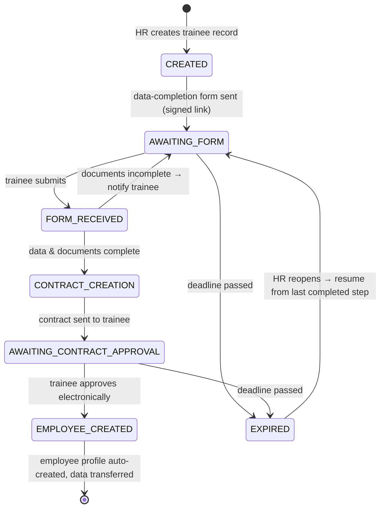
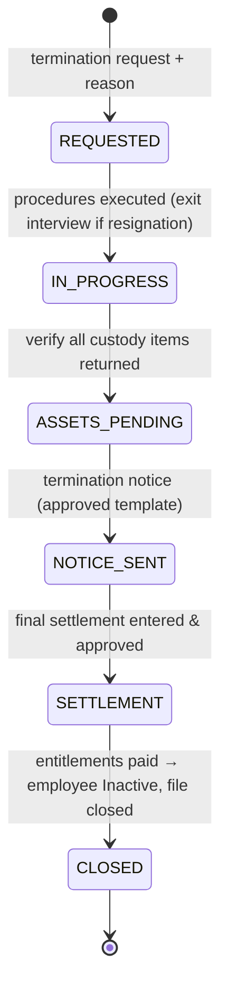

# HR System — Trainee Onboarding, Employee File & Offboarding

A bilingual (العربية / English) HR workflow system covering the full employee
lifecycle: **trainee intake → contract e-approval → employee file (GOSI, medical
insurance, criminal record, asset custody) → offboarding & final settlement** —
modelled as explicit **state machines** with an **SLA/reminder engine**,
**event-driven notifications**, **role-based access**, and an **append-only audit
trail** for everything.

> Built with Node.js + TypeScript (Express + Prisma + MySQL) and Vue 3 + Vuetify.
> Based on the company BRD (Arabic, 3 stages).


---

## 1. The three stages (from the BRD)

### Stage 1 — Trainee Management (إدارة المتدرب)



**SLA / automation rules** (stored in a config table, editable by admins — not hardcoded):

| Status | After | System action |
|---|---|---|
| Awaiting form completion | 24 hours | Auto-reminder → trainee + HR |
| Awaiting form completion | 10 calendar days | Status → `Expired` + notify HR |
| Contract creation | 2 working days | Reminder → HR |
| Awaiting contract approval | 5 working days | Daily reminders → trainee + HR |
| Awaiting contract approval | 10 calendar days | Status → `Expired` + notify HR |

Business rules: a contract cannot be created before trainee data is complete, nor
sent before all required documents are in; `Expired` stops all reminders; contract
approval auto-creates the employee profile with all data transferred; HR can
**reopen** an expired request and it resumes from the last completed step.

### Stage 2 — Employee File (ملف الموظف)

Starts automatically on contract approval. Four **fully independent** processes —
no delay in any of them blocks the employee from working or blocks the others:

| Process | Statuses | Notes |
|---|---|---|
| **GOSI** (التأمينات الاجتماعية) | Pending / Done / On Hold / Cancelled | On-hold reasons: optional subscription, government employee, DOB mismatch, ID mismatch, incomplete data, other |
| **Medical Insurance** (التأمين الطبي) | Pending / Done / On Hold / Cancelled | On-hold reasons: Elm data issue, other insurance exists, employee declined, awaiting insurer, incomplete data, other |
| **Criminal Record** (خلو السوابق) | Training / Request Sent / Pending / Done | Certificate attached to the employee file on receipt |
| **Asset Custody** (إدارة العهد) | Draft / Sent / Pending Employee Approval / Approved / Rejected / Cancelled | Electronic custody form → employee e-approves via signed link → assets linked to file |

An asset custody form carries employee data (name, employee no., department,
project, job title, delivery date) and **unlimited asset lines** (type, name,
serial number, quantity, new/used condition, notes). Approved assets stay linked
to the employee file for transfers, offboarding, and inventory.

### Stage 3 — Offboarding (إنهاء العلاقة التعاقدية)



Reasons: Resignation · Termination · Contract Expiry · Retirement · Death.
The exit-interview form is auto-sent **only for resignations**. Asset return is a
hard gate before approval. Settlement records due working days, leave balance,
deductions, and final entitlements (**entered by HR**, approval-flow enforced).

## 2. Architecture

```
Vue 3 + Vuetify (RTL/LTR, ar/en, dark/light)
      │  /api  (same origin — Vite proxy in dev)
      ▼
Route → Controller → Service (state machines, guards) → Repository (Prisma) → MySQL
                          │
                          ├─▶ Domain events → Event bus → Notifiers (email / in-app)
                          └─▶ AuditLog (append-only, same transaction)

Scheduler (SLA engine): periodically evaluates config-driven rules
→ reminders, daily nags, auto-expiry — every action audited & notified
```

- **Controllers** validate (Zod) and shape responses — no business logic.
- **Services** own the state machines; every transition checks a guard
  (role, completeness, asset-return, …) and writes the audit entry atomically.
- **Repositories** are the only Prisma callers — injected, transaction-aware, mockable.
- **Event bus + Notifier strategies** keep email/in-app notifications fully
  decoupled; templates are bilingual (ar/en).
- **Scheduler** turns the BRD's SLA table into behavior; rules live in the DB.

## 3. Access model

- **Staff** (HR, Admin): JWT login, role-based guards at routes and inside
  state-machine transitions.
- **Trainees / employees**: **no accounts** — every action they take (data form,
  contract approval, asset approval, exit interview) arrives as a **signed,
  expiring, single-purpose link** by email. Only the token hash is stored.

## 4. Data model (core)

`User` (staff, role) · `Trainee` (intake data, status, SLA anchors) ·
`Contract` · `Document` (typed uploads) · `Employee` (profile, Active/Inactive) ·
`GosiProcess` / `MedicalInsuranceProcess` / `CriminalRecordProcess` (status +
on-hold reason) · `Asset` (registry, unique serials) · `AssetForm` + `AssetFormItem`
(custody lifecycle) · `Offboarding` (+ reason, exit interview, settlement fields) ·
`SlaRule` (config-driven timers) · `Notification` (in-app + email log) ·
`LinkToken` (signed links) · `AuditLog` (append-only: who, what, from → to, when).

## 5. UX standards

- **Bilingual**: Arabic (default, RTL) and English (LTR) — one-click switch,
  everything translated including notification templates and generated documents.
- **Themes**: light & dark, user-persisted.
- **Motion**: subtle entrance/hover/page transitions — fast, never decorative-only.
- **Timeline**: every record shows its full audit history as a visual timeline.

## 6. Roadmap

- [x] **Phase A — Re-foundation.** MySQL (XAMPP-friendly), Vue 3 + Vuetify scaffold
  with i18n/RTL/themes/animations, CI, README v2. *(this commit)*
- [x] **Phase B — Data layer v2.** Full BRD schema + migrations + seed + repositories.
- [x] **Phase C — Workflow engine.** The four state machines + guards + reopen +
  audit, unit-tested in isolation.
- [x] **Phase D — SLA scheduler + notifications.** Config-driven timers, bilingual
  email + in-app bell, every send audited.
- [x] **Phase E — Stage 1 end-to-end.** Trainee API + HR screens + trainee
  signed-link form + contract e-approval.
- [x] **Phase F — Auth & RBAC.** Staff JWT + refresh, role guards, link-token auth.
- [x] **Phase G — Stage 2 end-to-end.** Employee file page, 4 process cards,
  asset registry + custody forms + e-approval.
- [x] **Phase H — Stage 3 end-to-end.** Offboarding wizard, asset-return gate,
  settlement flow, bilingual notice PDF.
- [ ] **Phase I — Hardening & delivery.** Idempotency, rate limiting, integration
  tests, seeded demo, docs.

## 7. Branching model

```
feature/phase-X-*  ──PR──▶  develop  ──PR──▶  staging  ──PR──▶  main
   (daily work)            (integration)       (QA/test)      (stable)
```

CI (lint + typecheck + tests + build) runs on every push and PR.

## 8. Getting started

Requirements: Node.js ≥ 20, MySQL/MariaDB (XAMPP works — start MySQL from the
XAMPP control panel), or `docker compose up -d` for a containerized MariaDB on
port 3307.

```bash
git clone https://github.com/basmakamal/employee-onboarding.git
cd employee-onboarding/backend
cp .env.example .env              # points at 127.0.0.1:3306 by default
npm install
npx prisma migrate deploy         # create tables
npx prisma db seed                # seed staff users
npm run dev                       # API → http://localhost:4000/api/health

cd ../frontend
npm install
npm run dev                       # UI  → http://localhost:3000
```

`GET /api/ready` reports real DB connectivity (`{"checks":{"db":"up"}}`).

## Tech stack

**Backend** Node.js · TypeScript · Express · Prisma 7 (`@prisma/adapter-mariadb`) ·
MySQL/MariaDB · Zod · pino · JWT
**Frontend** Vue 3 · Vuetify 3 · Pinia · Vue Router · vue-i18n · Vite
**Tooling** GitHub Actions · ESLint · Prettier · Vitest · Docker Compose (optional)

## License

MIT
