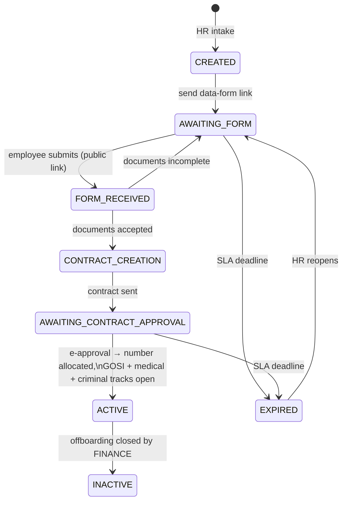

# HRMS Mobile — Architecture & Design Specification

**Status:** Draft 1 — architecture only (screens follow in a second document)
**Target stack:** Flutter 3.x · Riverpod · Dio · go_router · Material 3 · FCM · flutter_secure_storage
**Backend:** existing Node/TS + Prisma + MariaDB API (no business-logic redesign)

---

## 0. Executive summary — read this before anything else

The brief assumes a persona and module model that **this system does not have**. Three
facts from the source of truth, each verifiable in the code:

1. **Employees are not users.** There is no employee login, anywhere, by design.
   `prisma/schema.prisma:18-19` states it outright: *"Trainees and employees are NOT
   users — they act through signed link tokens."* The `User` table holds staff only.
2. **The roles are functional, not hierarchical.** `Role` = `HR | INSURANCE | IT |
   FINANCE | ADMIN` (`schema.prisma:20-26`). There is no Manager, no "HR Officer" vs
   "HR Manager", no team hierarchy — no employee record even has a manager *link*
   (`directManager` is a free-text string, not a relation).
3. **There is no Leave, Attendance, or Payroll module.** Not in the schema, not in the
   API, not in the UI. (`settlementLeaveDays` on `Offboarding` is a final-settlement
   number HR types in manually, not a leave balance.)

Consequently the requested "Employee / Manager" mobile app **cannot be built against
this backend** — it is not a mobile project, it is a new product surface requiring an
employee identity system and two new modules. This document therefore splits into two
tracks and is explicit about which is which:

| Track | Audience | Backend status | Verdict |
|---|---|---|---|
| **A — Staff Operations app** | HR, INSURANCE, IT, FINANCE, ADMIN | ~95% of endpoints already exist | **Build now** |
| **B — Employee Self-Service app** | Employees | Needs employee auth + Leave + Attendance modules | **Backend project first** (scoped in §11) |

**Track A is the valuable one, and it is genuinely mobile-shaped.** This system's daily
work is *approving, chasing, and unblocking records* — an INSURANCE officer clearing a
GOSI hold, HR pushing a stalled contract, FINANCE closing a settlement. That is queue
work: short, decision-shaped, interruption-driven. It belongs on a phone far more than
the data-entry screens do. Everything below designs for that.

**What already exists that makes this app small:** server-driven pagination and search
(phase 2), per-record `availableActions` from the state machines, an SSE realtime
channel, a notification table with `entity`/`entityId` deep-link anchors already on
every row, and an AI document-extraction endpoint that is *made* for a phone camera.

---

## Phase 1 — Analysis of the existing system

### 1.1 Module inventory

| # | Module | Backend | Web screen | Core objects |
|---|---|---|---|---|
| 1 | Auth | `src/auth/` | `/login` | JWT access (15m) + refresh cookie (7d, rotating, revocable) |
| 2 | Employee lifecycle | `modules/employees/` | `/employees`, `/employees/:id` | `Employee` (one record, birth → exit) |
| 3 | Onboarding pipeline | `onboarding.service.ts` | employee detail → pipeline card | `OnboardingDocument`, `Contract`, `LinkToken` |
| 4 | Stage-2 processes | `modules/processes/` | employee detail → 3 process cards | `GosiProcess`, `MedicalInsuranceProcess`, `CriminalRecordProcess` |
| 5 | Asset custody | `modules/assets/` | employee detail → custody dialog | `Asset`, `AssetForm`, `AssetFormItem` |
| 6 | Offboarding | `modules/offboarding/` | `/offboardings/:id` | `Offboarding` (+ exit interview, settlement) |
| 7 | Document expiry | `employee-document.*` | employee detail → documents tab | `EmployeeDocument` |
| 8 | HR requests log | `employee-request.*` | employee detail → services grid | `EmployeeRequest` (8 types) |
| 9 | Notifications | `notifications/` | bell + SSE | `Notification` (IN_APP / EMAIL) |
| 10 | Reports | `modules/reports/` | `/reports` | SQL aggregates + 4 streamed Excel exports |
| 11 | Dashboard | `modules/dashboard/` | `/` | status aggregates + recent activity |
| 12 | SLA automation | `workflow/sla-*` | `/automation` | `SlaRule`, `SlaFiring` (13 seeded rules) |
| 13 | Work calendar | `settings` | `/calendar` | `Holiday`, weekend config |
| 14 | Status ownership | `workflow/ownership.service.ts` | `/ownership` | `StatusOwnership` (status → role groups) |
| 15 | Mail settings | `settings` | `/settings` | `Setting` (encrypted SMTP creds) |
| 16 | User admin | `auth/users.routes.ts` | `/users` | `User` |
| 17 | AI assistant | `ai/` | `/assistant` | letters, data chat, **document extraction** |
| 18 | Ops health | `index.ts` | — (API only) | queues, DB/Redis, disk, table growth |

### 1.2 The lifecycle (the spine of the whole product)



Parallel, independent once ACTIVE: **GOSI**, **Medical insurance**, **Criminal record**,
**Asset custody** — none blocks another (BRD rule, enforced by separate machines).

### 1.3 Permission model — the most important finding for mobile

Permissions here are **not** a static role→screen map. They are computed **per record,
per status**, in three layers:

1. **Route gates** — `requireRole('HR','ADMIN')` etc. (coarse, per endpoint).
2. **State-machine transition roles** — each edge declares which roles may take it.
3. **`StatusOwnership` overrides** — an admin-editable table mapping
   `(processKey, status) → role groups`, which *replaces* the hardcoded roles at
   runtime (`ownership.service.ts`). ADMIN always passes.

The API already resolves all three and returns the answer with the record:

```jsonc
// GET /api/employees/:id
{ "availableActions": ["SEND_CONTRACT", "REOPEN"],
  "processActions": { "gosi": ["HOLD","COMPLETE"], "medical": [], "criminal": ["SEND_REQUEST"] } }
```

> **Mobile rule #1: never hardcode a permission in Flutter.** Action buttons are
> rendered *from* `availableActions`. An admin editing the ownership table changes the
> mobile UI with no app release. The only client-side gate is navigation visibility,
> which comes from a new `GET /api/me/capabilities` (§9.1).

### 1.4 Effective permission matrix (as coded today)

| Capability | HR | INSURANCE | IT | FINANCE | ADMIN |
|---|:--:|:--:|:--:|:--:|:--:|
| View employees / directory | ✅ | ✅ | ✅ | ✅ | ✅ |
| Create / edit employee, upload photo | ✅ | — | — | — | ✅ |
| Onboarding actions (send form, contract…) | ✅ | — | — | — | ✅ |
| Delete employee | — | — | — | — | ✅ |
| GOSI / medical process actions | ownership | ✅ | — | — | ✅ |
| Criminal record actions | ✅ | — | — | — | ✅ |
| Asset registry + custody forms | ownership | — | ✅ | — | ✅ |
| Offboarding: start, steps, asset return | ✅ | — | — | — | ✅ |
| Settlement amounts | ✅ | — | — | ✅ | ✅ |
| Close offboarding (final) | — | — | — | ✅ | ✅ |
| Expiry documents CRUD | ✅ | — | — | — | ✅ |
| Reports + exports | ✅ | — | — | — | ✅ |
| AI letters / assistant | ✅ | — | — | — | ✅ |
| Settings, SLA, calendar, ownership, users, health | — | — | — | — | ✅ |

"ownership" = granted only if the `StatusOwnership` table says so for that status.

### 1.5 Web → Mobile screen map

| Web screen | Mobile destination | Treatment |
|---|---|---|
| `/` HomePage (dashboard) | **Home** tab — role dashboard | Rebuilt: KPI strip + *my* queue + activity. Not a port. |
| `/employees` list + filters | **Directory** tab | Server search/filter/sort already exists; infinite scroll + filter sheet |
| `/employees/:id` (1,951 lines, 2 tabs, 11 dialogs) | **Employee file** — hub + 6 sub-routes | Split: Overview / Onboarding / Processes / Documents / Assets / Timeline. Dialogs → full-screen forms or bottom sheets |
| `/offboardings/:id` | **Offboarding detail** — stepper | Vertical stepper matching the 6 statuses |
| `/reports` | **Insights** (in More) | Charts + share-sheet export; heavy tables stay web-only |
| `/assistant` (AI chat) | **Assistant** — full screen | Plus camera → `extract-document` |
| `/users`, `/settings`, `/automation`, `/calendar`, `/ownership` | **More → Administration** | Read + light edit on mobile; complex rule editing stays web |
| `/form/:token` etc. (4 public link pages) | **Not in the app** | These are for non-users; they stay mobile-web. App deep-links *into* them only for preview |
| — | **Work** tab (new) | *No web equivalent.* The mobile-native centrepiece — see §3.2 |
| — | **Inbox** tab | Web has only a bell dropdown; mobile gets a real center |

---

## Phase 2 — Role-based mobile experience

Personas remapped from the brief to what actually exists. Each role gets a **queue**,
not a cut-down copy of the web app.

### 2.1 HR — "the case worker"
Owns the pipeline end to end. Tabs: Home · Work · Directory · Inbox · More.
Work queue: candidates awaiting form/contract, expired records to reopen, documents
expiring, offboardings mid-flow. Primary actions: send form, request missing docs,
accept documents, send contract, reopen, start offboarding.

### 2.2 INSURANCE — "the specialist"
Only GOSI + medical cards. Tabs: **Work · Directory · Inbox** (3 tabs — do not pad).
Work queue: every card in `PENDING` or `ON_HOLD` owned by INSURANCE, oldest first,
with hold reason chips. Primary actions: complete, hold (with reason), resume, cancel.
Home tab is *replaced* by Work — this role has no dashboard worth a tab.

### 2.3 IT — "the custodian"
Asset registry + custody forms. Tabs: Work · Assets · Inbox.
Work queue: draft forms to send, forms awaiting employee approval, unreturned items on
open offboardings. Serial-number scanning is the killer feature here (§7.2).

### 2.4 FINANCE — "the approver"
Narrowest and most mobile-suited: settlements to enter, offboardings to close.
Tabs: Work · Inbox · More. Salary/settlement figures are gated behind biometric
re-auth and excluded from screenshots (§12.4).

### 2.5 ADMIN — "the operator"
Everything, plus System Health (queues, DB/Redis, disk, table growth) — a genuinely
useful phone screen: it is the "is production OK?" glance.

### 2.6 Adaptation mechanism
```
login → GET /api/me/capabilities
     → { modules: [...], tabs: [...], role, ownership: {...} }
     → Riverpod capabilitiesProvider
     → go_router redirect guards + tab set built from `tabs`
```
Cached in secure storage for offline launch; refreshed on every foreground.

---

## Phase 3 — Navigation architecture

### 3.1 Structure
- **Bottom nav: 3–5 destinations, role-computed, never scrollable.** Fixed labels,
  Material 3 `NavigationBar`, badge on Inbox only.
- **Second level: `TabBar`** inside a record (employee file), never nested bottom navs.
- **Third level: full-screen routes** pushed onto the tab's own `Navigator` (each tab
  keeps independent history — go_router `StatefulShellRoute.indexedStack`).
- **Actions: bottom sheets.** Every state transition is a sheet with a title, an
  optional reason field, and one primary button. Never a dialog stack.
- **More: a list page**, not a drawer. Drawers are a desktop metaphor; they hide RTL
  poorly and cost a gesture.

### 3.2 The `Work` tab — the product's centre of gravity
One unified, server-ranked queue of *records where this user can act right now*,
computed from `StatusOwnership` + machine roles (new endpoint, §9.2):

```
┌─────────────────────────────────────┐
│ Work                        ⌄ Filter│
├─────────────────────────────────────┤
│ ⚠ OVERDUE · 3                        │
│ ● Nora Khalid          GOSI · ON_HOLD│
│   ID mismatch · 6 working days       │
│   [ Resume ]  [ Complete ]           │  ← from availableActions
├─────────────────────────────────────┤
│ TODAY · 5                            │
│ ● Ahmed Saleh   Contract · AWAITING  │
│   sent 2 days ago · SLA in 3 days    │
└─────────────────────────────────────┘
```
Swipe-right = primary positive action; swipe-left = hold/reject (sheet for reason).
Grouping: Overdue → Due today → This week → Later, from `statusChangedAt` + SLA rules.

### 3.3 RTL / bilingual
Arabic is the **default** locale and RTL is the default direction (matching the web).
This is not an afterthought: `Directionality` drives all layout, swipe-action
directions mirror, numerals stay Western per current web behaviour, and Hijri dates
(`birthDateHijri` exists on the schema) render alongside Gregorian where captured.

---

## Phase 4 — Dashboards (per real role)

**HR Home**
1. *SLA pressure strip* — Overdue / Due today / This week (tap → filtered Work).
2. *Pipeline funnel* — horizontal stacked bar over the 5 pipeline statuses, from
   `/api/dashboard.onboarding`. Tap a segment → filtered Directory.
3. *Expiring documents* — 4 buckets (expired / 30 / 60 / 90) from `/api/reports/summary`.
4. *Recent activity* — from `dashboard.recent` (audit-backed).

**INSURANCE / IT** — no vanity dashboard: a 2-tile counter row (open / on hold) pinned
above the queue.

**FINANCE** — settlements awaiting entry, offboardings awaiting closure, total
entitlement value pending (biometric-gated).

**ADMIN** — HR Home + System Health tile (DB latency, Redis, queue depth, disk %).

Chart rules: at most **one** chart per dashboard; everything else is numeric or a list.
No pie charts. No gradients. Sparklines only where a trend exists in the data (it
mostly doesn't — the API returns point-in-time aggregates, and inventing trends would
be a lie).

---

## Phase 5 — Design system

Derived from the existing web theme (`frontend/src/plugins/vuetify.ts`) so the two
products are visibly one family.

### 5.1 Color tokens
| Token | Light | Dark | Use |
|---|---|---|---|
| `primary` | `#1867C0` | `#5C9EEB` | primary actions, active nav |
| `secondary` | `#00695C` | `#26A69A` | accents, secondary chips |
| `surface` | `#FFFFFF` | `#161B26` | cards, sheets |
| `background` | `#F4F6FA` | `#0E1117` | scaffold |
| `success` | `#2E7D32` | `#66BB6A` | DONE / APPROVED / ACTIVE |
| `warning` | `#ED6C02` | `#FFA726` | ON_HOLD / expiring / SLA due |
| `error` | `#C62828` | `#EF5350` | EXPIRED / REJECTED / overdue |

**Status color is semantic, defined once** (`StatusChip` token map), never per screen —
the web currently duplicates this map in 3 files; the mobile app must not repeat that.

### 5.2 Spacing, radius, type
- 4pt base grid: `4, 8, 12, 16, 24, 32`. Screen padding 16. Card padding 16. List item
  min height 64 (72 with a secondary line).
- Radius: cards 16 (matches web `rounded="xl"`), buttons 12, chips full, sheets 28 top.
- Elevation: 0 everywhere except sheets/menus (level 2). Enterprise = flat + borders
  (`outlineVariant`), not shadows.
- Type (Material 3 scale, `Cairo` for Arabic + `Inter` for Latin, both variable):
  `displaySmall` unused · `headlineSmall` 24/32 screen titles · `titleMedium` 16/24 card
  titles · `bodyMedium` 14/20 content · `labelSmall` 11/16 metadata + chips.
- Density: **compact by default**. This is a data product; generous whitespace here
  reads as unfinished, not premium.

### 5.3 Component inventory (build once, reuse everywhere)
`StatusChip` · `PersonRow` (avatar + name + employee no + status) · `KpiTile` ·
`SectionCard` · `ActionSheet` (built from `availableActions`) · `TimelineTile` ·
`DocumentTile` (with expiry countdown) · `EmptyState` · `ErrorState` (with retry) ·
`SkeletonList` · `FilterSheet` · `SearchField` (debounced, server-backed).

### 5.4 States — mandatory for every async surface
Skeleton (never a bare spinner in a list) → content → empty (illustration + one-line
explanation + primary action) → error (cause + Retry) → offline banner (cached-at
timestamp). Pull-to-refresh on every list. Optimistic UI **only** for read-marking;
never for state transitions (the server is the authority and can reject with
`StaleTransitionError`).

---

## Phase 6 — Notification center

The backend is already deep-link ready: every `Notification` row carries `entity` +
`entityId` (`schema.prisma:574-600`), and templates are keyed
(`employee.*`, `staff.*`, `hr.*`).

| Category | Template keys | Deep link |
|---|---|---|
| SLA / stalled | `staff.record_stalled`, `staff.escalation`, `staff.record_expired` | record detail |
| Document expiry | `staff.document_expiring`, `staff.document_expiry_escalation` | employee → Documents tab |
| Onboarding | `hr.contract_approved` | employee file |
| Assets | `hr.asset_decided` | custody form |
| Offboarding | `hr.exit_interview_done` | offboarding detail |
| System | admin alerts (mail failures, phase 6) | System Health |

Center design: segmented filter (All / Unread / by category) · grouped by day ·
unread = left accent bar + surface tint (not a dot) · swipe to mark read · "Mark all
read" in the app bar · tap → deep link via go_router path built from `entity`.

Delivery: **FCM when backgrounded, SSE when foregrounded.** The SSE endpoint
(`GET /api/events`, phase 5) already exists and works in Flutter over Dio's
`ResponseType.stream`; push requires the backend work in §9.4.

---

## Phase 7 — Mobile-only capabilities (ranked by real value here)

1. **Camera → AI document extraction.** `POST /api/ai/extract-document` already accepts
   an image and returns document number + expiry + holder name. On mobile this becomes:
   HR points the camera at an Iqama → expiry-tracked document row pre-filled. This is
   the single highest-value mobile feature and it needs **zero** new backend.
   *(Note: §12.5 — this uploads identity documents to an external API; PDPL sign-off applies.)*
2. **Biometric unlock** (`local_auth`): app resume + before any salary/settlement view.
3. **Push notifications**: turns SLA reminders from "email you'll read tomorrow" into
   "handled in 30 seconds" — the core justification for the whole app.
4. **Serial-number scanning** (`mobile_scanner`) for asset custody items — IT's main
   friction today is typing serials.
5. **Offline read cache**: last Work queue + last 50 directory rows + open record,
   with a "cached · updated 14:32" banner. **Writes are never queued offline** —
   guarded transitions must fail loudly, not silently replay later.
6. **Share sheet** for generated AI letters (PDF) and Excel exports.
7. **Quick actions** (long-press launcher): Search employee · My work · Scan document.

*Deliberately rejected:* QR attendance (no attendance module), employee ID wallet (no
employee users), digital signature (the signed-link e-approval already is the legal
mechanism and rebuilding it in-app would fork the audit trail).

---

## Phase 8 — Screen inventory (Track A)

| # | Screen | Route | Roles | Primary API |
|---|---|---|---|---|
| 1 | Login | `/login` | all | `POST /api/auth/login` |
| 2 | Biometric gate | `/lock` | all | local |
| 3 | Home (role dashboard) | `/home` | HR, ADMIN | `/api/dashboard`, `/api/reports/summary` |
| 4 | Work queue | `/work` | all | `GET /api/work` *(new)* |
| 5 | Work filters | sheet | all | — |
| 6 | Directory | `/directory` | all | `GET /api/employees?q&filter&page` |
| 7 | Employee file — Overview | `/employees/:id` | all | `GET /api/employees/:id` |
| 8 | — Onboarding | `/employees/:id/onboarding` | HR, ADMIN | actions endpoint |
| 9 | — Processes (3 cards) | `/employees/:id/processes` | per ownership | process actions |
| 10 | — Documents | `/employees/:id/documents` | all / HR edit | `/employees/:id/documents` |
| 11 | — Assets | `/employees/:id/assets` | IT, HR | asset-form endpoints |
| 12 | — Timeline | `/employees/:id/timeline` | all | `/employees/:id/audit?page` |
| 13 | Add employee (2-step) | `/employees/new` | HR, ADMIN | `POST /api/employees` |
| 14 | Edit profile | `/employees/:id/edit` | HR, ADMIN | `PUT /api/employees/:id` |
| 15 | Contract draft | `/employees/:id/contract` | HR, ADMIN | `PUT .../contract` |
| 16 | Document capture (camera) | `/capture` | HR, ADMIN | `POST /api/ai/extract-document` |
| 17 | Custody form builder | `/asset-forms/:id` | IT, HR | asset endpoints |
| 18 | Scan serial | `/scan` | IT | local |
| 19 | Offboarding stepper | `/offboardings/:id` | HR, FINANCE, ADMIN | offboarding endpoints |
| 20 | Settlement entry | `/offboardings/:id/settlement` | HR, FINANCE, ADMIN | `PUT .../settlement` |
| 21 | Inbox | `/inbox` | all | `/api/notifications` |
| 22 | Insights | `/insights` | HR, ADMIN | `/api/reports/summary` |
| 23 | Assistant (AI chat) | `/assistant` | HR, ADMIN | `POST /api/ai/chat` |
| 24 | Letter generator | `/assistant/letter` | HR, ADMIN | `POST /api/ai/letters` |
| 25 | More | `/more` | all | — |
| 26 | Administration hub | `/admin` | ADMIN | settings endpoints |
| 27 | System health | `/admin/health` | ADMIN | `GET /api/admin/health` |
| 28 | Profile & preferences | `/me` | all | `/api/auth/me` |

28 screens. Compare with the web's 12 routes + 11 inline dialogs — the mobile app is
*more* screens but each is smaller, which is the correct trade on a phone.

---

## Phase 9 — API requirements

### 9.1 `GET /api/me/capabilities` *(new — required)*
```jsonc
{ "role": "INSURANCE",
  "tabs": ["work", "directory", "inbox"],
  "modules": { "employees": "read", "processes": "write", "assets": "none", ... },
  "ownership": { "GOSI": ["PENDING","ON_HOLD"], "MEDICAL_INSURANCE": ["PENDING"] } }
```
Derived from `Role` + `StatusOwnership` — no new business logic, just exposure.

### 9.2 `GET /api/work` *(new — required)*
The unified queue: records whose current status this user's role owns, joined with
their SLA pressure. Server-side ranking, keyset pagination, `?bucket=overdue|today|week`.
Implementable entirely from existing tables (`StatusOwnership` + `statusChangedAt` +
`SlaRule`).

### 9.3 Mobile auth adjustment *(required)*
The refresh token is an httpOnly cookie scoped to `/api/auth` — correct for the SPA,
unusable for Flutter. Add a mobile grant: `POST /api/auth/login` with header
`X-Client: mobile` returns `refreshToken` in the **body**; `POST /api/auth/refresh`
accepts it in the body. Storage: `flutter_secure_storage` (Keychain / EncryptedSharedPrefs).
The phase-3 `jti` revocation store already makes these tokens single-use and killable —
mobile inherits that for free.

### 9.4 Push registration *(required for FCM)*
- `POST /api/me/devices` `{ token, platform }` → new `DeviceToken` table
- Worker sends FCM alongside each `IN_APP` row (extends the existing `publishNotify`
  fan-out — one function, already the single choke point)
- `DELETE /api/me/devices/:token` on logout

### 9.5 Smaller gaps
| Need | Status |
|---|---|
| Notifications pagination + category | `GET /api/notifications` returns a fixed slice; add `?page&category` |
| Global search across entities | only employees are searchable; add `GET /api/search` or defer |
| Photo / document fetch | works with a Bearer header — use `CachedNetworkImage(httpHeaders:)`; **do not** add query-string tokens |
| Offboarding list | only `GET /:id` exists; `GET /api/offboardings?status=` needed for the Work queue |
| Excel exports on mobile | stream to a temp file via Dio → OS share sheet |

**Unchanged:** every workflow, guard, role rule, and SLA rule. The mobile app is a new
*client*, not a new *system*.

---

## Phase 10 — Flutter project structure

### 10.1 State management: **Riverpod** (as requested) — with a house style
- `AsyncNotifierProvider` per feature; `ref.invalidate` after a transition rather than
  hand-rolled cache mutation (the server is authoritative — re-fetch the record).
- `codegen` (`riverpod_annotation`) for type safety; no global mutable singletons.
- Repository layer between Dio and providers, so tests inject fakes exactly as the
  backend does with its `Db` seam.

### 10.2 Folder structure (feature-first, mirroring the backend modules)
```
lib/
├── main.dart
├── app/                    # bootstrap, theme, router, localization
│   ├── router.dart              # go_router + StatefulShellRoute + guards
│   ├── theme/                   # tokens.dart, light.dart, dark.dart, typography.dart
│   └── l10n/                    # ar.arb (default), en.arb
├── core/
│   ├── network/                 # dio client, auth interceptor, refresh queue, errors
│   ├── storage/                 # secure storage, offline cache (drift or hive)
│   ├── realtime/                # SSE client + FCM handler
│   ├── permissions/             # capabilities provider, action gating
│   └── widgets/                 # design-system components (§5.3)
├── features/
│   ├── auth/                    # data/ domain/ presentation/
│   ├── work/
│   ├── directory/
│   ├── employee/                # overview, onboarding, processes, documents, assets, timeline
│   ├── assets/
│   ├── offboarding/
│   ├── notifications/
│   ├── insights/
│   ├── assistant/
│   └── admin/
└── shared/                      # models (mirroring API DTOs), formatters, extensions
```
Each feature: `data/` (dto + repository) · `domain/` (entities + value objects) ·
`presentation/` (providers + screens + widgets).

### 10.3 Key packages
`flutter_riverpod` · `riverpod_annotation` · `dio` · `go_router` · `freezed` +
`json_serializable` · `flutter_secure_storage` · `firebase_messaging` · `local_auth` ·
`mobile_scanner` · `cached_network_image` · `intl` · `shimmer` · `drift` (offline cache)

---

## Phase 11 — Track B: what Employee self-service would require

Not a design gap — a **backend product gap**. Honest scope before any UI work:

| Need | Size |
|---|---|
| Employee identity: credentials or SSO on `Employee`, separate token audience from staff JWTs, invite/reset flow | 10–15 md |
| Leave module: types, balances, accrual rules, request → approval workflow, calendar integration | 20–30 md |
| Attendance module: check-in/out, geofence or QR, shifts, corrections, timesheets | 20–30 md |
| Manager hierarchy: `managerId` relation (currently free text), team scoping on every query | 8–12 md |
| Self-service reads: my profile, my documents, my assets, my payslips (payroll doesn't exist either) | 8–12 md |
| **Total before a single Employee screen** | **~65–100 md** |

Recommendation: **ship Track A first.** It serves the people who use this system daily,
needs ~5 new endpoints, and will teach you what the employee app should be. Meanwhile
the existing signed-link pages already give employees their four moments (data form,
contract approval, asset approval, exit interview) on mobile web — which is the
correct, credential-free design for people who interact with HR four times a year.

---

## Phase 12 — Security

1. **Token storage**: access token in memory only; refresh token in `flutter_secure_storage`.
   Never `SharedPreferences`, never disk-cached in Dio.
2. **Single-use refresh** is already enforced server-side (phase 3 `jti` store) — a
   cloned device gets logged out on the next rotation, which is the desired signal.
3. **Certificate pinning** on the production host via `dio` `badCertificateCallback`;
   HTTPS-only, no cleartext (`android:usesCleartextTraffic="false"`).
4. **Sensitive screens**: salary, settlement, national ID → biometric re-auth +
   `FLAG_SECURE` (Android) / `isSecureTextEntry` overlay (iOS) to block screenshots and
   the app-switcher preview.
5. **PDPL**: the camera→AI extraction feature sends identity documents to an external
   API. This is the same open compliance question flagged in the scalability audit; the
   `AI_REDACT_PII` flag exists for letters but extraction is inherently the document
   itself. **Get legal sign-off before shipping feature #1 in §7.**
6. **Logging**: no PII in crash reports; scrub `nationalId`, `iban`, `salary` from any
   telemetry. No third-party analytics SDK on HR data without a DPA.
7. **Root/jailbreak detection**: warn, don't block (enterprise devices vary).
8. **Deep links**: verify the target record's permission server-side on open — never
   trust a notification payload to grant a view.

---

## Phase 13 — Performance

1. **Pagination is already server-side** (phase 2) — mobile must use it: `limit=20`,
   infinite scroll, never fetch-all. The web's old mistake must not be re-imported.
2. **Employee file**: load the Overview payload, lazy-load each tab on first visit; the
   timeline is paginated (`/audit?page`) — never render 500 audit rows at once.
3. **Images**: `cached_network_image` with a disk cache; request thumbnails if a resize
   endpoint is added later (photos are currently served at full size).
4. **List rendering**: `ListView.builder` + `const` widgets + `AutomaticKeepAlive` off
   for long lists; target 60fps scroll with ≤16ms builds.
5. **SSE only in foreground** — close the stream on `paused` and rely on FCM, or you
   will hold a socket and drain battery.
6. **Cold start budget**: < 2s to first meaningful paint using the cached capabilities
   + cached Work queue while the network refresh runs behind a subtle top progress line.
7. **Bundle**: no full icon font (the web's 3.6MB `@mdi/font` mistake) — use tree-shaken
   `Icons` + a curated custom set.

---

## Appendix A — Delivery plan (Track A)

| Milestone | Contents | Est. |
|---|---|---|
| M0 — backend enablers | `/me/capabilities`, `/work`, mobile auth grant, device tokens + FCM send, offboarding list | 8–12 md |
| M1 — shell | Auth, biometrics, router, theme/tokens, l10n + RTL, design-system components | 10–14 md |
| M2 — read paths | Home, Work, Directory, Employee file (6 tabs), Inbox + SSE/FCM | 15–20 md |
| M3 — write paths | All transitions via `availableActions` sheets, forms, custody builder, offboarding stepper, settlement | 15–20 md |
| M4 — mobile-native | Camera extraction, serial scanning, offline cache, share/export, quick actions | 10–14 md |
| M5 — hardening | Pinning, secure screens, error/empty states pass, perf pass, store submission | 8–12 md |
| **Total** | | **~66–92 md** |

## Appendix B — Open decisions for the client

1. **Track B scope** — is Employee self-service in this budget, or is Track A the product?
2. **PDPL** — camera document extraction: approved, or ship without AI extraction?
3. **Distribution** — public stores, or MDM/enterprise distribution (changes signing,
   pinning, and root-detection policy)?
4. **Offline depth** — read-only cache (recommended) or queued writes (not recommended,
   conflicts with guarded transitions)?
5. **Brand** — reuse the web palette (assumed here) or a dedicated mobile brand pass?
